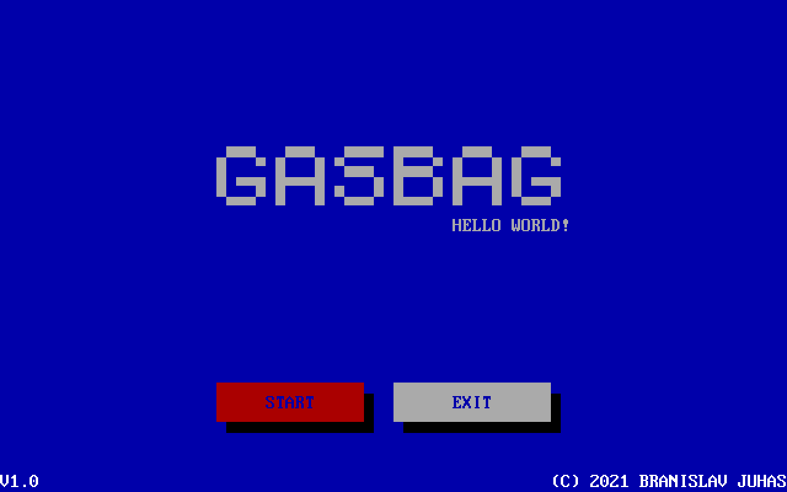

# GASBAG

  

## Description

The "GASBAG" game is a classic MS-DOS game developed in QuickBASIC 4.5 (QB45). It provides an engaging balloon shooting experience where players control a shooter at the bottom of the screen, aiming to shoot falling balloons. The game progressively increases in difficulty, providing a challenging and entertaining gaming experience.

## User Manual

### How to Play

**Run the Game:**
- Ensure your MS-DOS environment is ready.
- Compile the source code in QB45.
- Execute the compiled program.

### Controls

- **Left Arrow Key:** Move the shooter to the left.
- **Right Arrow Key:** Move the shooter to the right.
- **Spacebar:** Shoot balloons.

### Objective

- Shoot balloons to earn points.
- Avoid allowing balloons to reach the bottom of the screen.

### Game Flow

1. **Game Start:**
   - The game begins with a menu offering options like Start, Continue, and Restart.

2. **Scoring:**
   - Increment your score by shooting balloons.

3. **Game End:**
   - The game concludes if a balloon reaches the bottom.

4. **Leaderboard:**
   - After each game, the top three scores and times are displayed.

Enjoy the "GASBAG" game and aim for the top of the leaderboard!

## Setup and Compilation

### Environment
- Ensure you have an MS-DOS environment or use an emulator.
- Use QuickBASIC 4.5 (QB45) for compilation.

### Compilation
1. Open the QB45 environment.
2. Load the provided source code into the editor.
3. Compile the program.
4. Run the compiled executable in the MS-DOS environment.

## Technical Documentation

### Code Overview

The code is organized into subroutines and functions to enhance readability and maintainability. Here's an overview of key aspects:

| **Aspect** | **Description** |
|------------|-----------------|
| **Global Variables** | Variables like `SHOOTERX`, `RUNNING`, and `SCORE` store essential game state information. Arrays such as `BULLET()` and `BSCORE()` manage bullet coordinates and top scores. |
| **Constants** | Constants like `TRUE`, `FALSE`, and `EMP` are defined for clarity in the code. |
| **User Interaction** | The game relies on user input through arrow keys and the spacebar. |
| **Game Logic** | The core game logic involves shooting balloons, moving the shooter, and updating scores. |
| **Menu System** | The menu system provides options for starting, continuing, and restarting the game. |
| **Leaderboard** | The leaderboard displays the top three scores and times after each game. |
| **Timers** | Timers control various aspects of the game, including balloon falling speed and shooting intervals. |
| **Modular Structure** | The code is organized into subroutines and functions, enhancing readability and maintainability. |
| **Overall Functionality** | The game offers a classic shooting experience with interactive menus, scoring, and leaderboard features. |

### Subroutines and Functions

Here's a detailed breakdown of key subroutines and functions:

| **Name** | **Description** |
|----------|-----------------|
| `CTIMEDO` | Increments timers for game events. |
| `MENU` | Displays the game menu and handles user input. |
| `PRINTMENU` | Prints the menu options on the screen. |
| `GIVESCORE` | Records and updates the player's score. |
| `LEADERBOARD` | Displays the top scores and times. |
| `RUNGAME` | Main game loop controlling the game flow. |
| `STARTGAME` | Initializes game variables and starts the game. |
| `BRISE` | Moves the bullet upwards on the screen. |
| `CTIMEDO` | Updates timers for game events. |
| `FALLB` | Moves the falling balloon down the screen. |
| `SHOOT` | Initiates the shooting action. |
| `MOVE` | Moves the shooter left or right. |
| `PRINTMENU` | Displays the game menu. |
| `SUMBALLOON` | Handles balloon creation and falling. |
| `XERA` | Checks if the bullet hits a balloon. |

### User Interaction

The game's interactivity is based on user input:

| **User Input** | **Description** |
|-----------------|-----------------|
| Arrow Keys | - **Left Arrow Key:** Move the shooter to the left. - **Right Arrow Key:** Move the shooter to the right. |
| Spacebar | Shoot balloons. |

### Game Logic

The core game logic involves:

| **Logic Component** | **Description** |
|---------------------|-----------------|
| Shooting Balloons | Players shoot balloons to earn points. |
| Moving Shooter | Players can move the shooter left or right to aim at falling balloons. |
| Scoring | The game increments the player's score for each successfully shot balloon. |
| Balloon Falling | Balloons fall from the top, and the game ends if a balloon reaches the bottom. |
| Timers | Timers control various aspects of the game, ensuring smooth gameplay. |

### Menu System

The game includes a menu system with options:

| **Menu Option** | **Description** |
|-----------------|-----------------|
| Start | Initiates a new game. |
| Continue | Allows the player to continue a paused game. |
| Restart | Restarts the game from the beginning. |

### Leaderboard

The leaderboard displays the top three scores and times:

| **Leaderboard Entry** | **Description** |
|-----------------------|-----------------|
| Position | Position in the top scores. |
| Score | The player's score. |
| Time | The time at which the score was achieved. |

### Timers

Timers are essential for controlling various aspects of the game:

| **Timer** | **Function** |
|-----------|--------------|
| CTIMEDO | Increments timers for game events. |
| CTIMER(1) | Controls the speed of shooter movement. |
| CTIMER(2) | Manages the shooting interval. |
| CTIMER(3) | Controls the falling speed of balloons. |

### Modular Structure

The code is modular, divided into subroutines and functions for clarity:

| **Module** | **Description** |
|------------|-----------------|
| Shooting | Functions related to shooting balloons and managing bullets. |
| Movement | Functions handling movement of the shooter and falling balloons. |
| Menu System | Subroutines for displaying and handling the game menu. |
| Scoring | Functions related to scoring and updating the leaderboard. |
| Initialization | Subroutines for initializing game variables and starting the game. |

### Overall Functionality

The game offers a complete and engaging experience:

| **Functionality** | **Description** |
|-------------------|-----------------|
| Shooting Experience | Provides a classic balloon shooting experience. |
| Interactivity | Responsive to user input through arrow keys and the spacebar. |
| Scoring System | Tracks and updates the player's score. |
| Menu Options | Interactive menu with options for starting, continuing, and restarting the game. |
| Leaderboard | Displays the top three scores and times after each game. |

